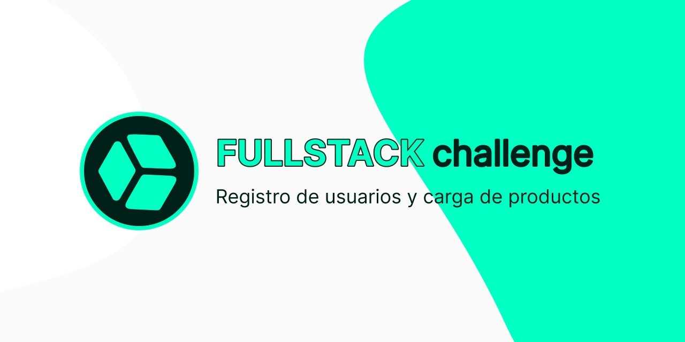

# Fullstack challenge

<a href="https://coxmau77.github.io/fullstack-challenge/public/" target="_blank" rel="noopener noreferrer">
  
</a>

<a href="https://github.com/coxmau77/fullstack-challenge" target="_blank" rel="noopener noreferrer">gitHub repository</a>

<!-- <a href="" target="_blank" rel="noopener noreferrer">txt</a> -->

Proyecto basico desarrollado utilizando las tecnologias:

- HTML
- CSS
- javaScript
- Node js
- Express
- Axios
- Mongo DB

En este proyecto podremos registrar usuarios en la plataforma y lograr hacer un CRUD con este usuario.

[]()
<a href="https://www.figma.com/design/Qqy8RI4BIAt7HVGlSMgu2H/fullstack-challenge?node-id=0-1&t=kQWUTraUVBHt3TjA-1">Documentacion grafica</a>

## Proceso

### 00. **Prework de nuestro entorno de trabajo**

- Instalación de VSC _Visual Studio Code_
- Instalación de Git
- Creación de cuenta en GitHub
- Creación de cuenta en Figma
- Creación de cuenta en MongoAtlas
- Creación de cuenta en RENDER

### 01. **Estructura basica del challenge**

Iniciamos desde gitHub, por lo que en principio deberemos tener una cuenta creada, comandos basicos con git, clonar, comprender **main** y **master**, `git add .`, que es `.gitignore`, pull y push

Primeros comandos por consola.

Estructura y definicion de la arquitectura del proyecto en `HTML`, `MVC`, `HTML semantic` _(nav, section, article, header, aside)_, `favicon`.

Primeros pasos en `Figma`.

Aplicamos estilos CSS utilizando `selectores avanzados`, `CSS Nesting`, `Variables CSS`, Pseudo elementos como `:root`, `:after`, `:before`, Concepto mobile First, rem, em.

Creacion y vinculacion con los primeros documentos en un **_lenguaje de programacion_**, javaScript `script.js` `server.js`

Primeros conceptos del Modelo `Cliente >< Servidor` - parte I

```
public
├─css
│ └─style.css
├─img
│ └─icon.svg
├─js
  └─script.js
```

### 02. **Documentos HTML**

Creacion de los documentos `HTML`, `form`, `label`, `submit`, `etiquetas semanticas HTML`.

Implementacion de [Bootstrap icons](https://icons.getbootstrap.com/) `CDN`

CSS _(`Google Fonts con CSS Import`, `reset CSS`, `root`, `box-sizing`)_

HTML _(required, placeholder, autofocus, submit, autocomplete)_

Github (GitHub Pages, portada Repository, add, commit, push)

### 03. **CSS flexbox, advanced selectors**

Estilo y alineacion `header` , Flexbox,

Dar proporciones a los contenedores y dar formato a los formularios

### 04. **CSS grid, responsive**

Grid, Grid templates, @media responsive site y adaptacion a los distintas resoluciones

### 05. **[Tailwind](https://tailwindcss.com/) + [Flowbite](https://flowbite.com)**

Instalacion de Tailwind mediante CDN + integraciones de Flowbite componentes, y estilos en [`public/home.html`](https://coxmau77.github.io/fullstack-challenge/public/home.html)

### 06. **JavaScript**

Revision de conceptos e implementacion de variables y constantes, tipos de datos, `string`, `int`, `Boolean`, utilizacion de `console.log`, `console.info`, `console.warn`, `console.error`, `alert` y `prompt`

Etiqueta form, input(text, password, button, submit)

`document.querySelector()` para almacenar en una variable y acceder a su valor con el Metodo `.value`

Consola del navegador(cliente) como herramienta de desarrollo

Primeros conceptos del Modelo `Cliente >< Servidor` - parte II

Crear en una actividad donde se pueda utilizar la informacion que se captura en un input de un formulario (login o signin)

## ERRORES que podemos encontrar

### En el caso que veas este error en la consola del cliente, debe saber que:

`Error with Permissions-Policy header: Origin trial controlled feature not enabled: 'interest-cohort'`

Este aviso indica que estás intentando utilizar una característica experimental llamada `"Interest Cohort"` en tu sitio web, pero no has habilitado la prueba de origen (origin trial) correspondiente.

`"Interest Cohort"` es una característica que permite a los sitios web agrupar a los usuarios en cohortes basadas en sus intereses, con el fin de proporcionar publicidad más relevante sin comprometer la privacidad de los usuarios.

**Para habilitar esta característica**, debes registrarte en el programa de pruebas de origen de Google y agregar una cabecera específica a tu sitio web.

Aquí te explico los pasos:

1. Regístrate en el programa de pruebas de origen de Google:
2. Busca la prueba de origen para "Interest Cohort" y regístrate para participar.
3. Una vez aprobada tu solicitud, recibirás un token de prueba de origen.
4. Agrega la siguiente cabecera a tu sitio web:
   Permissions-Policy: interest-cohort=<token_de_prueba_de_origen>
5. Reemplaza <token_de_prueba_de_origen> con el token que recibiste en el paso 3.
6. Una vez que hayas completado estos pasos, el aviso debería desaparecer y podrás utilizar la característica "Interest Cohort" en tu sitio web.

Ten en cuenta que las pruebas de origen son temporales y pueden cambiar o expirar en cualquier momento. Asegúrate de revisar la documentación oficial para obtener más información sobre las pruebas de origen y las características experimentales por lo que **no sera necesario que hagas esta configuracion para tu proyecto** :wink:
